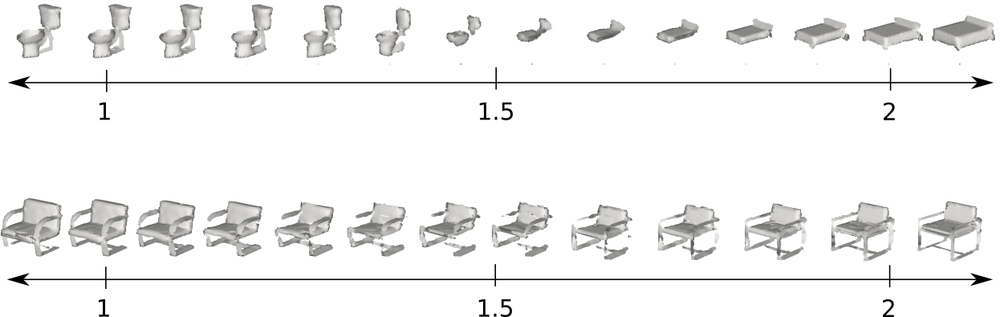

# DeepSDF Shape representation
3D shape representation with DeepSDF

# Description

This small project show how two 3D shapes (.off mesh files) can be voxelized and sdf values can be assigned to them.
Then the DeepSDF model is used to train these two shapes in an implicit neural representation. Doing so can provide a 
to reconstruct and generate shapes with one variable. 

# How to use?
Any two shapes (.off files) can be placed in [dataset](./dataset/) folder to find a method to have a transition from one shape to other with one single paramter.

To run the the training run [train](./src/train.py).
 
# Parts
The [config](./config.json) is used to put all the config info on it.

The DeepSDF model is place at [this](./model/DeepSDFmodel.py). You can also see the on-the-fly tests on the [this](./src/notebook.ipynb) notebook file.

# Results

# Notes
DeepSDF is a great tool for implicit 3D shapre representation. However, the transition should be smarter than this to avoid meaningless shapes between these two shapes. 

